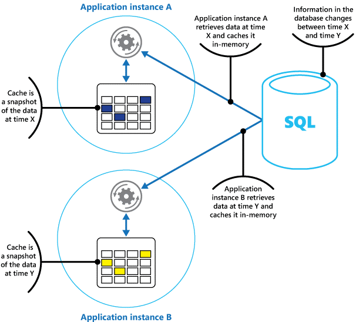

# spring-caching-examples

# Overview

Caching at its most fundamental level, provides a means of being able to retrieve data faster than would otherwise 
be possible if a complete trip was to have occurred to retrieve that data from some persistent storage such as an RDBMS.

This set of samples provides two examples of caching strategies possible within the enterprise.

- **Single Node Caching** (spring-caching-with-caffeine)
- **Distributed Caching** (spring-caching-with-redis)

## Local Cache

An **In-Process Cache** is an object-based cache implementation which runs within the same VM as the application. 
It’s a caching strategy which works well for non-distributed systems.



### Advantages

As an in-process caches shares proximity with the application in question, it offers the lowest amount of latency possible, 
and is quite easy to maintain.

### Disadvantages

As it shares the same heap space as the application it serves, care must be taken to ensure that the memory 
requirements of the cache do not starve the running application's memory needs. If the actual application were to
run out of heap space, there would be no easy way to recovering from it.

### Use Case: 

Choose this strategy when you are making standalone, non-distributed applications. 

If attempting to use this in medium, to large-sized distributed applications which more than likely are load-balanced, 
remember that you will end up with as many caches as there are instances of your application; each cache having its own
manifestation of cache state. To counter the effects of the potential inconsistencies which could arise in this scenario, 
use this type of caching strategy to store immutable object references, ensuring that reads are always accurate and consistent.

## Distributed Cache

A **Distributed Cache** is external to the application and is typically deployed on a cluster of multiple nodes, 
offering a single logical view (and state) of the cache.


### Advantages

- Much simpler to maintain.
- Very reliable.
- Only one place to update.
- Assures data consistency.

### Disadvantages

A distributed cache will have two major overheads that will make it slower than an in-process cache 
network latency and object serialization.

### Use Case:

Use this strategy if the application to be deployed across multiple nodes and/or if your application has a requirement
to cache mutable objects references where there is a desire to always have those reads be consistent.

# Spring Caching Abstraction

The Spring Framework provides support for transparently adding caching support to a Spring application. The 
[Spring Cache Abstraction](https://docs.spring.io/spring-boot/docs/2.3.0.RELEASE/reference/htmlsingle/#boot-features-caching) 
allows for consistent usage of various Caching solutions with minimal changes made to the codebase.


The examples use H2 as the RDBMS. For access to the H2 console, please navigate to:

```
http://localhost:[port]/h2-console
```

where:

**[port]** is the port used to host the specific application.

|   Application                 | Port      | Description                           |
|-------------------------------|-----------|---------------------------------------|
| spring-caching-with-caffeine  | 10090     | Cache implementation using Caffeine   |
| spring-caching-with-redis     | 10091     | Cache implementation using Redis      |

### Additional References

The following guides illustrate how to use some features concretely:
* [Caching Data with Spring](https://spring.io/guides/gs/caching/)
